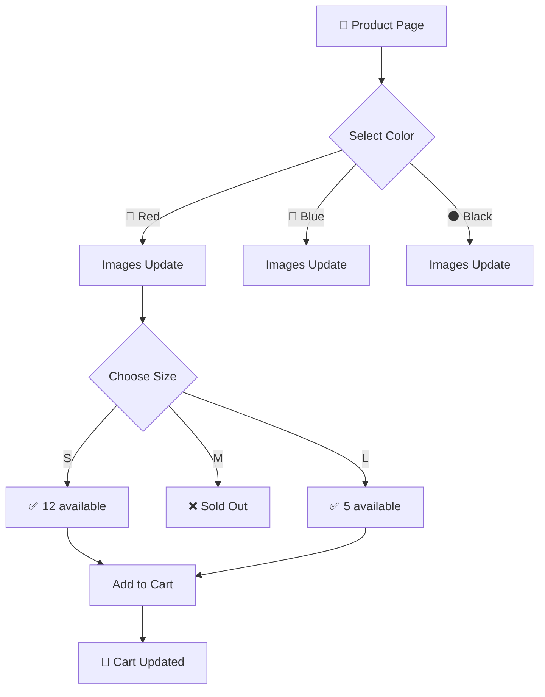

<div align="center">
<!-- Logo and Title -->


### 🛍️ Revolutionary Social E-Commerce Platform

*Where Fashion Meets Technology & Community*

[](https://flutter.dev)
[](https://firebase.google.com)
[](https://bloclibrary.dev)


</div>

---

## 📱 App Showcase

<div align="center">

### Experience the Future of Shopping

<details open>
<summary>☀️ View Light Mode Screenshots</summary>
<br>
<table width="100%">
<tr>
    <td width="50%" align="center">
        
        <p><b>🎯 Onboarding</b><br/>Welcome experience</p>
    </td>
    <td width="50%" align="center">
        
        <p><b>🔐 Authentication</b><br/>Login & Sign up</p>
    </td>
</tr>
<tr>
    <td width="50%" align="center">
        
        <p><b>🏠 Home Screen</b><br/>Dynamic feed & carousels</p>
    </td>
    <td width="50%" align="center">
        
        <p><b>📂 Categories</b><br/>Browse by category</p>
    </td>
</tr>
<tr>
    <td width="50%" align="center">
        
        <p><b>👕 Product Details</b><br/>Black variant selected</p>
    </td>
    <td width="50%" align="center">
        
        <p><b>🎨 Color Change</b><br/>White variant - Live update</p>
    </td>
</tr>
<tr>
    <td width="50%" align="center">
        
        <p><b>❤️ Wishlist</b><br/>Saved favorites</p>
    </td>
    <td width="50%" align="center">
        
        <p><b>🛒 Shopping Cart</b><br/>Checkout & promo codes</p>
    </td>
</tr>
<tr>
    <td width="50%" align="center">
        
        <p><b>📍 Shipping Address</b><br/>Manage addresses</p>
    </td>
    <td width="50%" align="center">
        
        <p><b>📦 Order Details</b><br/>Track your order</p>
    </td>
</tr>
<tr>
    <td width="50%" align="center">
        
        <p><b>💬 Social Chat</b><br/>Talk to real buyers</p>
    </td>
    <td width="50%" align="center">
        
        <p><b>👤 User Profile</b><br/>Account management</p>
    </td>
</tr>
<tr>
    <td width="50%" align="center">
        
        <p><b>🌍 Language Settings</b><br/>10+ languages support</p>
    </td>
    <td width="50%" align="center">
        
        <p><b>🇸🇦 RTL Support</b><br/>Profile in Arabic</p>
    </td>
</tr>
<tr>
    <td width="50%" align="center">
        
        <p><b>➕ Add Product</b><br/>Admin - Create new product</p>
    </td>
    <td width="50%" align="center">
        
        <p><b>✏️ Edit Product</b><br/>Admin - Manage products</p>
    </td>
</tr>
</table>
</details>

<details>
<summary>🌙 View Dark Mode Screenshots</summary>
<br>
<table width="100%">
<tr>
    <td width="50%" align="center">
        
        <p><b>🎯 Onboarding</b><br/>Welcome experience</p>
    </td>
    <td width="50%" align="center">
        
        <p><b>🔐 Authentication</b><br/>Login & Sign up</p>
    </td>
</tr>
<tr>
    <td width="50%" align="center">
        
        <p><b>🏠 Home Screen</b><br/>Dynamic feed & carousels</p>
    </td>
    <td width="50%" align="center">
        
        <p><b>📂 Categories</b><br/>Browse by category</p>
    </td>
</tr>
<tr>
    <td width="50%" align="center">
        
        <p><b>👕 Product Details</b><br/>Black variant selected</p>
    </td>
    <td width="50%" align="center">
        
        <p><b>🎨 Color Change</b><br/>White variant - Live update</p>
    </td>
</tr>
<tr>
    <td width="50%" align="center">
        
        <p><b>❤️ Wishlist</b><br/>Saved favorites</p>
    </td>
    <td width="50%" align="center">
        
        <p><b>🛒 Shopping Cart</b><br/>Checkout & promo codes</p>
    </td>
</tr>
<tr>
    <td width="50%" align="center">
        
        <p><b>📍 Shipping Address</b><br/>Manage addresses</p>
    </td>
    <td width="50%" align="center">
        
        <p><b>📦 Order Details</b><br/>Track your order</p>
    </td>
</tr>
<tr>
    <td width="50%" align="center">
        
        <p><b>💬 Social Chat</b><br/>Talk to real buyers</p>
    </td>
    <td width="50%" align="center">
        
        <p><b>👤 User Profile</b><br/>Account management</p>
    </td>
</tr>
<tr>
    <td width="50%" align="center">
        
        <p><b>🌍 Language Settings</b><br/>10+ languages support</p>
    </td>
    <td width="50%" align="center">
        
        <p><b>🇸🇦 RTL Support</b><br/>Profile in Arabic</p>
    </td>
</tr>
<tr>
    <td width="50%" align="center">
        
        <p><b>➕ Add Product</b><br/>Admin - Create new product</p>
    </td>
    <td width="50%" align="center">
        
        <p><b>✏️ Edit Product</b><br/>Admin - Manage products</p>
    </td>
</tr>
</table>
</details>

</div>

---

## 🎯 What is Batrina?

Batrina is a **revolutionary social e-commerce platform** that transforms online fashion shopping into a community-driven experience. Built with Flutter and Firebase, it's not just an app—it's the future of how people shop.

### 💡 The Vision

> "Shopping shouldn't be lonely. What if you could ask real buyers about products? What if links opened directly in the app? What if e-commerce was actually... social?"

Batrina makes this vision a reality. It's the **first platform** where commerce and community truly merge.

---

## ✨ Revolutionary Features

### 💬 **Social Shopping - The Game Changer**

<table>
<tr>
<td width="60%">

The feature that makes Batrina **truly unique**

#### 🌟 Chat with Real Buyers

- See reviews on any product
- Click on reviewer profiles
- Send chat requests to ask questions
- Get **genuine feedback** about sizing, quality, fit
- Share products within conversations
- Build a shopping community
- Get honest, real feedback before buying

#### Why This Matters:

- ✅ Real conversations with real people 
- ✅ Build trust through community  
- ✅ Share products within chats  
- ✅ Make informed decisions

**Example Flow:**
```
See 5⭐ review → Click reviewer → Send chat request 
→ "Hi! How's the fit?" → Get honest answer 
→ Make informed decision
```

</td>
<td width="40%">

```ascii
┌──────────────────┐
│  Product Page    │
│⭐⭐⭐⭐⭐ 4.8  │
│                  │
│  Recent Reviews: │
│                  │
│  👤 Sarah M.     │
│  "Perfect fit!   │
│   Great quality" │
│  [💬 Chat]       │
│                  │
│  👤 Ahmed K.     │
│  "True to size"  │
│  [💬 Chat]       │
└────────┬─────────┘
         │
    Click Chat
         ▼
┌──────────────────┐
│  💬 Chat Room    │
├──────────────────┤
│ You:             │
│ Hi! How's the    │
│ sizing? I'm      │
│ usually Medium.  │
│                  │
│ Sarah:           │
│ Perfect! Go with │
│ your usual size. │
│ Quality is       │
│ amazing 👍       │
│                  │
│ [🛍️ Share Item]  │
└──────────────────┘
```

</td>
</tr>
</table>

---

### 🔗 **Deep Linking Magic**

**Seamless integration between app and the outside world:**

<table>
<tr>
<td width="50%">

#### ✉️ Email Verification (Zero Friction)

**Traditional Way:**
```
1. Sign up
2. Get email with 6-digit code
3. Go back to app
4. Type code manually
5. Hope you didn't mistype
```

**Batrina Way:**
```
1. Sign up
2. Click link in email
3. App opens automatically
4. Account verified ✅
5. Done!
```

#### 🔑 Password Recovery

**One-Click Reset:**
- Forgot password → Email sent
- Click link → **App opens**
- Enter new password → Done!

No code copying, no switching between apps.

</td>
<td width="50%">

#### 🛍️ Product Sharing

**Share Anywhere, Open Anywhere:**

```
You find amazing shirts
        ↓
Click share → WhatsApp
        ↓
Friend receives:
"Check these out! 
 https://batrina-76502.web.app/product?id=p01"
        ↓
Friend clicks link
        ↓
Batrina opens automatically
        ↓
Product page loads
        ↓
Friend adds to cart!
```


</td>
</tr>
</table>

---

### 🎨 **Live Product Customization**

**The most advanced product experience in mobile e-commerce:**

<table>
<tr>
<td width="55%">

#### 🎨 Real-Time Color Selection

When a user selects a color:
- Product images **update instantly**
- No page reload, no waiting
- Smooth animations

#### 📏 Smart Size Selection

- Each color variant has different sizes
- Each size shows **real-time stock count**
- "12 available" updates live from Firebase

#### 🧠 The Intelligence Behind It

```
Product Matrix:
├── Red
│   ├── S (12 in stock) ✅
│   ├── M (0 in stock) ❌
│   └── L (5 in stock) ✅
├── Blue
│   ├── S (8 in stock) ✅
│   ├── M (15 in stock) ✅
│   └── L (3 in stock) ✅
└── Black
    ├── S (0 in stock) ❌
    ├── M (20 in stock) ✅
    └── L (7 in stock) ✅
```

Real-time sync with Firebase Firestore!

</td>
<td width="45%">



**Technical Excellence:**
- Matrix-based inventory system
- Real-time Firebase listeners
- Optimistic UI updates
- Smart image caching
- Lazy loading for performance
- Smooth animations (60 FPS)

**User Experience:**
- Instant visual feedback
- No waiting, no loading
- Clear stock indicators

</td>
</tr>
</table>

---

### 🛒 **Intelligent Cart & Checkout**

<table>
<tr>
<td width="50%">

#### 🧠 Concurrency Control

**The Challenge:**
Two users buying the last item simultaneously.

**Our Solution:**

```dart
// Transaction-based stock control
Firebase.runTransaction(() {
  1. Lock product
  2. Get current stock
  3. Validate quantity
  4. If available → Deduct & proceed
  5. If sold → Alert user
  6. Release lock
});
```

**What Happens:**
- User A adds last item to cart
- User B tries to checkout with it
- System detects conflict
- User B sees: "Sorry, just sold out!"
- Seamless error handling

**User Experience:**
- ✅ Never oversell products
- ✅ Instant feedback
- ✅ Alternative suggestions
- ✅ Smooth error handling

</td>
<td width="50%">

#### 🎟️ Promo Code System

**Features:**
- Auto-validate codes
- Percentage discounts (20% OFF)
- Expiry date checking

**Smart Application:**
```
Cart Total: $200

User enters: SAVE20
→ Validates code
→ Checks expiry (Valid ✅)
→ Applies 20% discount
→ New Total: $160
```

**Admin Control:**
- Create unlimited codes
- Set expiry dates
- Track usage stats
- Performance analytics

</td>
</tr>
</table>

---

### 🔐 **Secure & Seamless Authentication**

<table>
<tr>
<td width="50%">

#### 🔑 Multi-Provider Login

**Email & Password**
- Secure registration
- Strong password validation
- Email verification required

**🔵 Google Sign-In**
- One-tap authentication
- No password needed
- Secure OAuth flow

#### 🎬 Onboarding Experience

- Beautiful intro screens
- Feature highlights
- Swipe navigation
- Smooth animations
- First-time user guide

</td>
<td width="50%">

#### ✉️ Smart Verification Flow

```
Traditional Apps        Batrina
─────────────────      ─────────────
1. Sign up             1. Sign up
2. Get 6-digit code    2. Get email
3. Switch to email     3. Click link
4. Memorize code       4. ✅ Verified!
5. Switch to app       
6. Enter code          Total: 2 steps
7. Hope it's right     
8. ✅ Maybe verified   

Total: 8 steps
```
**Password Recovery**
```
✅ Request reset
✅ Click email link
✅ App opens
✅ Enter new password
✅ Done!
```

**The Batrina Difference:**
- Zero code typing
- No app switching
- One-click process
- Instant verification
- Professional UX

</td>
</tr>
</table>

---

### 🏠 **Dynamic Home Experience**

<table>
<tr>
<td width="33%">

#### 🎠 Home Screen

**Features:**
- Auto-scrolling carousels
- Featured product banners
- Category quick access
- Bottom navigation bar

**Performance:**
- Lazy loading
- Image caching
- Smooth scrolling
- 60 FPS animations

</td>
<td width="33%">

#### 🔍 Smart Search

**Real-Time Search:**
- Instant results
- Search-as-you-type

**Advanced Filters:**
- 💰 Price range slider
- ⭐ Rating (1-5 stars)
- 📁 Categories

**Sorting Options:**
- Price: Low to High
- Price: High to Low  
- Rating: Best first

</td>
<td width="33%">

#### 👕 Product Details

**Rich Information:**
- HD image gallery
- Swipe-through photos
- Color variants
- Description details
- Stock status

**Social Elements:**
- ⭐ Average rating
- 📊 Rating breakdown
- 💬 Reviews
- 🔗 Share product
- ❤️ Add to wishlist

</td>
</tr>
</table>

---

### 👤 **Complete Profile System**

<table>
<tr>
<td width="25%">

#### 📝 Personal Info
- Full name
- Profile photo
- Email address
</td>
<td width="25%">

#### ❤️ Wishlist

**Features:**
- Save unlimited items
- Fast add to cart button
</td>
<td width="25%">

#### 📦 Order Management
- Complete history
- Status tracking
```
Pending
    ↓
Processing
    ↓
Shipped
    ↓
Out for Delivery
    ↓
Delivered ✅
```

</td>
<td width="25%">

#### 📍 Addresses

**Features:**
- Multiple addresses
- Default selection
- Address validation
- Delete option

</td>
</tr>
</table>

---

### 🌍 **Truly Global Platform**

<div align="center">

#### 🗣️ 10+ Languages Supported

</div>

<table>
<tr>
<td align="center" width="20%">🇬🇧<br/><b>English</b></td>
<td align="center" width="20%">🇸🇦<br/><b>العربية</b></td>
<td align="center" width="20%">🇨🇳<br/><b>中文</b></td>
<td align="center" width="20%">🇮🇳<br/><b>हिन्दी</b></td>
<td align="center" width="20%">🇪🇸<br/><b>Español</b></td>
</tr>
<tr>
<td align="center" width="20%">🇫🇷<br/><b>Français</b></td>
<td align="center" width="20%">🇩🇪<br/><b>Deutsch</b></td>
<td align="center" width="20%">🇯🇵<br/><b>日本語</b></td>
<td align="center" width="20%">🇵🇹<br/><b>Português</b></td>
<td align="center" width="20%">🇷🇺<br/><b>Русский</b></td>
</tr>
</table>

<table>
<tr>
<td width="50%">

#### ⚙️ Localization Features

**Complete Translation:**
- Every screen
- Every button
- Every message
- Error messages
- Notifications

**Smart Detection:**
- Auto-detect device language
- Switch anytime
- Persistent preference
- No app restart needed

**RTL Support:**
- Perfect Arabic layout
- Mirrored UI elements
- Text alignment

</td>
<td width="50%">

#### 🎨 Adaptive Theming

**☀️ Light Mode**
- Clean & minimal design
- High readability
- Eye-friendly colors
- Professional aesthetic
- Optimized contrast

**🌙 Dark Mode**
- True black (#000000)
- OLED screen optimized
- Battery saving
- Reduced eye strain
- Premium look & feel
- Perfect for night use

**Smart Switching:**
- Auto-detect system theme
- Manual toggle in settings
- Smooth transitions
- Consistent colors
- Adaptive icons

</td>
</tr>
</table>

---

### 👑 **Powerful Admin Dashboard**

**One App, Two Experiences - User Mode & Admin Mode**

<table>
<tr>
<td width="50%">

#### 📦 Product Management

**Add Products:**
- Upload multiple images
- Set product name & description
- Define color variants
- Add sizes per color
- Set stock for each variant
- Category assignment

**Edit Products:**
- Update any field instantly
- Modify pricing
- Adjust inventory
- Change images
- Update descriptions
- Manage variants

**Smart Interface:**
- Visual product grid
- Quick edit buttons
- Drag-and-drop reordering

</td>
<td width="50%">

#### 📊 Business Control

**Order Management:**
- View all orders (real-time)
- Order details view
- Update order status

**Order Flow:**
```
New Order
    ↓
Review Details
    ↓
Mark as Processing
    ↓
Update Tracking Info
    ↓
Mark as Shipped
    ↓
Delivered
```

</td>
</tr>
</table>

**🔐 Access Control:**
Admin users see "Switch to Admin Mode" button in profile. One tap transforms the entire app into a management dashboard with full business control.

---

## 🛠️ Technical Excellence

<div align="center">

### Built with Modern Tech Stack

<table>
<tr>
<td align="center" width="25%">
<br/>
<b>Flutter 3.24+</b><br/>
Cross-platform framework
</td>
<td align="center" width="25%">
<br/>
<b>Firebase Suite</b><br/>
Complete backend solution
</td>
<td align="center" width="25%">
<br/>
<b>Cubit + Provider</b><br/>
State management
</td>
<td align="center" width="25%">
<br/>
<b>Material Design 3</b><br/>
Modern UI system
</td>
</tr>
</table>

### Firebase Integration

**🔐 Authentication** - Email, Google OAuth, session management  
**📊 Firestore** - Real-time database, offline support, transactions  
**📁 Storage** - Image uploads, CDN delivery, compression  

### State Management

**Cubit** - Simple states (loading, success, error)  
**Provider** - Complex states (cart, user, theme)  

### Performance Optimizations

⚡ **Image Caching** - Cached network images, lazy loading  
⚡ **Code Splitting** - Feature-based modules, on-demand loading  
⚡ **Database Indexing** - Optimized Firestore queries  
⚡ **Pagination** - Infinite scroll, load on demand  
⚡ **Asset Optimization** - Compressed images, vector icons

</div>

---

## 💎 What Makes Batrina Special

<table>
<tr>
<td width="33%" align="center">

### 🚀 Innovation
**Amazing social shopping platform** where users chat with real buyers before purchasing. Revolutionary approach to e-commerce.

</td>
<td width="33%" align="center">

### 🎨 Design Excellence
Pixel-perfect UI with **Dark/Light themes**, **10+ languages**, **smooth animations**, and **attention to detail** in every screen.

</td>
<td width="33%" align="center">

### ⚡ Performance
Optimized for **60 FPS**, instant loading, works on **low-end devices**, and handles **thousands of products** smoothly.

</td>
</tr>
<tr>
<td width="33%" align="center">

### 🔗 Seamless UX
**Deep linking everywhere** - from email verification to product sharing. Zero friction between app and external world.

</td>
<td width="33%" align="center">

### 🧠 Smart Logic
**Real-time stock control**, concurrency handling, intelligent error recovery, and **transaction-based** operations.

</td>
<td width="33%" align="center">

### 👑 Complete Solution
**Two apps in one** - Full shopping experience for users + Powerful admin dashboard for business management.

</td>
</tr>
</table>

---
<div align="center">

### Made with ❤️ using Flutter

**© 2026 Batrina - Redefining Social Commerce**

</div>
